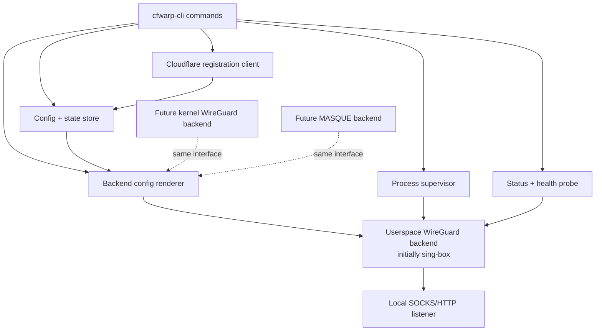

# Design — Minimal WireGuard Proxy MVP

## Overview

This design defines the first implementation path for `cfwarp-cli`:

- **support Linux and macOS on Apple Silicon, with broader platform support expected later**
- **prioritize Docker deployment for the initial milestone**
- **explicit proxy mode first**
- **WireGuard-based userspace backend first**
- **direct Cloudflare registration owned by this project**

The MVP will not attempt to recreate the full Cloudflare One client. Instead, it will own the minimal path required to:

1. register or import Cloudflare consumer WARP credentials
2. generate a backend configuration
3. launch a local proxy bound to a local port
4. support endpoint override (`优选 IP`)
5. package the whole flow into a repeatable Docker deployment

### Design decisions

1. **Use a userspace WireGuard proxy backend first**
   - Rationale: lowest-friction Docker deployment; avoids `NET_ADMIN`, `wg0`, and route-table complexity for MVP.
2. **Own registration directly instead of calling `wgcf`**
   - Rationale: clearer supply chain, fewer moving parts, easier UX.
3. **Keep backend logic abstracted**
   - Rationale: future kernel-WireGuard and MASQUE support should fit without redesigning the CLI contract.
4. **Start with explicit proxy mode only**
   - Rationale: easiest to validate and distribute before adding transparent routing.

---

## Minimal-effort implementation references

These are the concrete references to mine first while coding the MVP.

### Primary reference: `Mon-ius/Docker-Warp-Socks`
Use as the closest working example of the exact MVP direction.

Relevant files inspected:
- `https://github.com/Mon-ius/Docker-Warp-Socks`
- `dev/v5/entrypoint.sh`
- `dev/v5/Dockerfile`

What to borrow conceptually:
- direct registration flow against Cloudflare consumer API
- runtime config generation for a userspace WireGuard proxy
- lightweight Docker packaging with no `NET_ADMIN`
- mixed proxy listener pattern as a future enhancement

What **not** to copy as-is:
- `curl | sh` bootstrap via shortlink
- monolithic shell entrypoint with inline JSON string assembly
- hard-coded external URLs without provenance checks

### Secondary reference: `MicroWARP`
Use for endpoint override ideas and operational UX.

Relevant files inspected:
- `https://github.com/ccbkkb/MicroWARP`
- `entrypoint.sh`
- `Dockerfile`

What to borrow conceptually:
- explicit endpoint override variable
- clear runtime logs around config generation and startup
- persistent state volume pattern

What **not** to copy as-is:
- the “pure C” framing
- runtime download of opaque external tools when avoidable

### Tertiary reference: official-client Docker patterns
Use only as parity guidance for UX shape, not as the MVP data plane.

Relevant reference:
- `https://github.com/cmj2002/warp-docker`

What to borrow conceptually:
- stable proxy-oriented container UX
- persistent state volume and image publishing patterns

---

## Architecture



### Initial backend choice

The initial backend will be a **userspace WireGuard runner backed by `sing-box`**.

Why this choice:
- already proven in lightweight WARP proxy implementations
- avoids kernel privileges for the first Docker deployment
- supports local proxy in the same runtime
- can be treated as an implementation detail behind a backend interface

### Future backends

The design explicitly reserves two future backends:
- `wireguard-kernel`: kernel `wg` / route-managed path for later transparent mode
- `masque`: future backend for closer Cloudflare-suite parity

Those are not implemented in the MVP.

---

## Components and Interfaces

### 1. CLI layer

The CLI provides the operator contract.

Proposed initial commands:
- `cfwarp-cli register`
- `cfwarp-cli import`
- `cfwarp-cli render`
- `cfwarp-cli up`
- `cfwarp-cli down`
- `cfwarp-cli status`
- `cfwarp-cli endpoint test`
- `cfwarp-cli version`

#### Command behavior summary

- `register`: generate keypair, call Cloudflare registration API, persist account state
- `import`: ingest previously generated credentials/state
- `render`: write backend config to stdout or a file without launching
- `up`: validate state, render config, launch backend, persist PID/runtime info
- `down`: stop managed backend and remove transient files
- `status`: read state, inspect process, optionally probe local port and external trace
- `endpoint test`: validate candidate endpoint inputs and optionally perform lightweight backend checks

### 2. Config and state store

The CLI will separate durable config from ephemeral runtime state.

#### Proposed host paths

- config/state root: `${XDG_CONFIG_HOME:-~/.config}/cfwarp-cli/`
- runtime root: `${XDG_STATE_HOME:-~/.local/state}/cfwarp-cli/`

#### Proposed container paths

- durable state: `/var/lib/cfwarp-cli/`
- runtime scratch: `/run/cfwarp-cli/`

State files:
- `account.json` — registration material and metadata
- `settings.json` — operator settings such as listen port, auth, endpoint override, backend choice
- `runtime.json` — pid, started-at time, config path, last error, health snapshot
- `backend.json` or generated config file — backend-specific rendered config

### 3. Cloudflare registration client

The registration client owns the bootstrap flow.

Responsibilities:
- generate X25519 keypair
- call the consumer registration endpoint
- parse response fields needed by WireGuard-based backends
- store account metadata safely

MVP assumption:
- consumer WARP registration only
- no Zero Trust token flow yet

The client should be implemented inside the codebase rather than delegated to `wgcf` or shell scripts.

### 4. Backend abstraction

Define a backend interface in code similar to:

```text
Backend {
  Name() string
  ValidatePrereqs(ctx) error
  RenderConfig(input) -> RenderResult
  Start(ctx, renderResult) -> RuntimeInfo
  Stop(ctx, runtimeInfo) error
  Status(ctx, runtimeInfo) -> BackendStatus
}
```

#### MVP backend: `singbox-wireguard`
Responsibilities:
- render a `sing-box` config with:
  - WireGuard endpoint and keys
  - WARP-assigned addresses
  - local proxy inbound listener
  - optional auth
  - endpoint override
- launch `sing-box run -c <config>`
- report process state and last failure

### 5. Process supervisor

Responsibilities:
- spawn backend process
- capture stdout/stderr to log files
- store PID and launch metadata
- detect stale runtime files
- ensure `down` can stop the correct process

### 6. Health and status probe

Status should answer three separate questions:

1. do we have valid persisted registration/config?
2. is the backend process alive?
3. is the proxy locally usable?

Optional higher-cost probe:
- request `https://www.cloudflare.com/cdn-cgi/trace` through the proxy and report whether `warp=on`

This probe should be optional because it depends on external network reachability.

---

## Data Models

### AccountState

```json
{
  "account_id": "string",
  "token": "string",
  "license": "string",
  "client_id": "string",
  "warp_private_key": "string",
  "warp_peer_public_key": "string",
  "warp_ipv4": "string",
  "warp_ipv6": "string",
  "created_at": "RFC3339 timestamp",
  "source": "register|import"
}
```

### Settings

```json
{
  "backend": "singbox-wireguard",
  "listen_host": "0.0.0.0",
  "listen_port": 1080,
  "proxy_mode": "socks5",
  "proxy_username": "optional",
  "proxy_password": "optional",
  "endpoint_override": "optional host:port",
  "state_dir": "path",
  "log_level": "info"
}
```

### RuntimeState

```json
{
  "pid": 1234,
  "backend": "singbox-wireguard",
  "config_path": "/run/cfwarp-cli/backend.json",
  "stdout_log_path": "/var/lib/cfwarp-cli/logs/backend.stdout.log",
  "stderr_log_path": "/var/lib/cfwarp-cli/logs/backend.stderr.log",
  "started_at": "RFC3339 timestamp",
  "last_error": "optional string",
  "local_reachable": true,
  "last_trace_summary": "optional string"
}
```

### EndpointCandidate

```json
{
  "value": "162.159.192.1:2408",
  "source": "manual|default|env",
  "valid": true,
  "last_tested_at": "optional RFC3339 timestamp",
  "last_result": "optional success|failure",
  "notes": "optional string"
}
```

---

## Docker Deployment Strategy

The MVP must ship with a **specific, low-friction Docker deployment**.

### Container image shape

Initial image contents:
- `cfwarp-cli` binary
- `sing-box` binary
- CA certificates
- non-root runtime user
- entrypoint that runs `cfwarp-cli up --foreground`

### Recommended single-container deployment

```yaml
services:
  cfwarp:
    image: ghcr.io/<owner>/cfwarp-cli:latest
    container_name: cfwarp
    restart: unless-stopped
    ports:
      - "127.0.0.1:1080:1080"
    environment:
      CFWARP_LISTEN_HOST: 0.0.0.0
      CFWARP_LISTEN_PORT: 1080
      CFWARP_PROXY_MODE: socks5
      CFWARP_ENDPOINT_OVERRIDE: ""
    volumes:
      - cfwarp-data:/var/lib/cfwarp-cli

volumes:
  cfwarp-data:
```

### Recommended consumer-container pattern

For an app container that already supports `ALL_PROXY` / `HTTPS_PROXY`:

```yaml
services:
  cfwarp:
    image: ghcr.io/<owner>/cfwarp-cli:latest
    restart: unless-stopped
    environment:
      CFWARP_LISTEN_HOST: 0.0.0.0
      CFWARP_LISTEN_PORT: 1080
    volumes:
      - cfwarp-data:/var/lib/cfwarp-cli

  app:
    image: curlimages/curl
    depends_on:
      - cfwarp
    environment:
      ALL_PROXY: socks5h://cfwarp:1080
    command: ["sh", "-lc", "curl -fsSL https://www.cloudflare.com/cdn-cgi/trace"]

volumes:
  cfwarp-data:
```

### Entrypoint behavior

The image entrypoint should:
1. load settings from env vars and state files
2. register only if no stored account exists
3. render backend config
4. launch backend in foreground
5. return non-zero on startup failure

### Why this deployment is the minimum-effort starting point

- no `NET_ADMIN`
- no host WireGuard dependency
- no opaque bootstrap shortlinks
- persistent registration data via volume
- easy local and CI testing

---

## Error Handling

### Registration errors
- invalid API response
- request timeout
- Cloudflare API unavailable
- local persistence failure

Behavior:
- do not destroy previous valid account state
- return actionable message
- optionally keep raw response in debug logs only

### Render errors
- missing required account fields
- invalid endpoint override
- invalid proxy auth settings
- missing backend binary

Behavior:
- fail before launching backend
- print which setting caused failure

### Runtime errors
- backend exits immediately
- local port bind failure
- stale pid/runtime file
- health probe timeout

Behavior:
- record last known runtime error
- expose through `status`
- ensure `down` can clean up stale state safely

### Docker-specific errors
- unwritable volume
- missing CA certs or DNS resolution
- invalid env var types

Behavior:
- log clearly on stderr
- exit non-zero so orchestrators can restart or surface failure

---

## Testing Strategy

### Unit tests

Cover:
- env/config parsing
- registration request/response parsing
- endpoint validation
- backend config rendering
- state file load/store semantics

### Golden/config tests

Cover:
- rendered `sing-box` config for:
  - no auth
  - auth enabled
  - endpoint override enabled
  - dry-run render

### Process supervision tests

Cover:
- backend start/stop with a fake runner
- stale runtime file handling
- log capture and status reporting

### Integration tests

Cover:
- local command flow against a mocked registration server
- Docker image boot with persisted state volume
- optional live test behind an opt-in flag that checks `cdn-cgi/trace`

### Manual verification target

The first end-to-end verification target for development should be:

```bash
docker run --rm -it -p 1080:1080 \
  -v cfwarp-data:/var/lib/cfwarp-cli \
  ghcr.io/<owner>/cfwarp-cli:dev

curl --proxy socks5h://127.0.0.1:1080 https://www.cloudflare.com/cdn-cgi/trace
```

Success criteria:
- proxy port accepts connections
- `cdn-cgi/trace` shows `warp=on`

---

## Implementation notes for fastest start

1. **Language recommendation: Go**
   - good fit for CLI, JSON, HTTP, process supervision, static binaries, Docker shipping.
2. **First backend recommendation: `sing-box`**
   - do not implement WireGuard transport from scratch.
3. **First deployment target: Docker only**
   - keep host-mode support in code structure, but validate the Docker image first.
4. **First status probe: local port reachable**
   - make remote trace probing optional until the basics are stable.
5. **First endpoint feature: manual override only**
   - auto-selection can come later.

This is the minimum-effort path that still gives the project a real, owned implementation surface.
