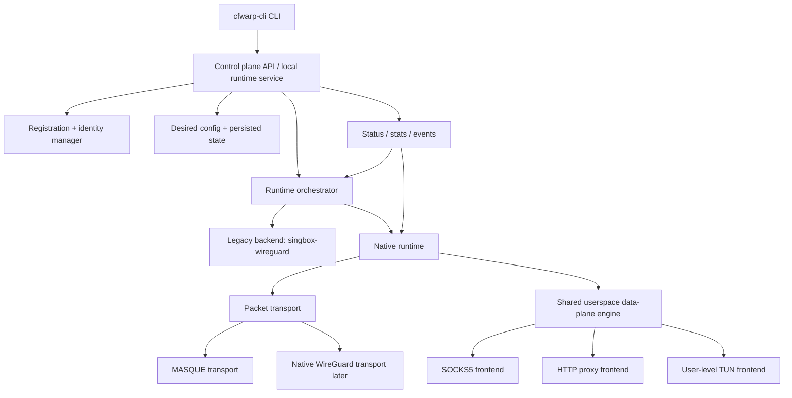

# Design — Unified Transport and Shared Data Plane

## Overview

This design defines the next major architecture step for `cfwarp-cli`.

Goals:

- keep the project **CLI-first** and **agent-friendly**
- separate **control plane**, **transport**, and **exposure mode** cleanly
- support **MASQUE** and **WireGuard** under a common runtime shape
- avoid binding proxy/TUN logic to any one transport implementation
- preserve the existing `singbox-wireguard` path as a transitional backend
- target **Alpine** as the only package/build target in this phase

The key shift is that future transports will plug into a **packet tunnel abstraction**, while SOCKS5, HTTP proxy, and user-level TUN will be implemented through a **shared userspace data-plane engine**.

### Design decisions

1. **Unify transports at the packet tunnel boundary**
   - Rationale: WireGuard and MASQUE are different protocols, but both can be modeled as packet transports.
2. **Build one shared userspace data-plane engine**
   - Rationale: avoids duplicating SOCKS/HTTP/TUN handling per transport and keeps control over performance-sensitive paths.
3. **Do not port `usque`'s proxy architecture**
   - Rationale: `usque` is a valuable protocol reference, but not the desired app/runtime structure for this project.
4. **Move the CLI toward the official `warp-cli` mental model**
   - Rationale: transport choice, service mode, registration, and runtime state should be first-class concepts.
5. **Keep `singbox-wireguard` during the migration**
   - Rationale: retains a stable, working backend while the native runtime is built out.
6. **Package only for Alpine in this phase**
   - Rationale: minimize packaging and CI variability until the native runtime architecture is stable.

---

## Key reference inputs

### `Diniboy1123/usque`
Use as the MASQUE protocol and packet-tunnel reference.

What to borrow conceptually:
- MASQUE enrollment flow after consumer registration
- ECDSA keypair + self-signed cert flow for MASQUE TLS auth
- QUIC / HTTP3 / CONNECT-IP details required for Cloudflare compatibility
- reconnect loop and packet buffer pooling

What **not** to copy as-is:
- global config singleton model
- command-owned transport setup duplication
- proxy mode implementation structure
- ad-hoc endpoint parsing and tightly coupled CLI/runtime flow

### Official `warp-cli`
Use as the UX and control-plane reference.

Important ideas to mirror:
- distinction between **mode** and **tunnel protocol**
- daemon/service-oriented runtime ownership
- machine-readable introspection (`status`, `settings`, `stats`)
- explicit runtime knobs for proxy and tunnel options

What **not** to copy as-is:
- undocumented implementation details
- broad feature surface unrelated to this project's scope
- settings or modes that rely on closed-source services outside current goals

---

## Architecture



### Layer boundaries

#### 1. Control plane
Owns:
- registration and import flows
- persisted desired state
- runtime lifecycle
- command handling
- status, stats, events, and machine-readable output

It should not own packet forwarding loops.

#### 2. Transport layer
Owns:
- Cloudflare-facing tunnel protocol
- session establishment and teardown
- packet read/write operations
- transport-specific stats/events

It should not own proxy listeners or CLI behavior.

#### 3. Shared data-plane engine
Owns:
- userspace IP stack
- shared DNS path
- packet I/O integration with the selected transport
- dial/listen helpers used by SOCKS5/HTTP/TUN frontends
- buffer pooling and other reusable performance-sensitive utilities

#### 4. Frontends / service modes
Own:
- exposing the shared engine as SOCKS5, HTTP proxy, or user-level TUN
- auth and listener configuration specific to the frontend
- per-mode health and lightweight metrics

---

## Components and Interfaces

### 1. Control plane runtime model

The project should evolve from a pure `up/down` process launcher toward a local runtime service model.

Proposed command direction:
- `cfwarp-cli registration new|import|show|delete`
- `cfwarp-cli transport set|show`
- `cfwarp-cli mode set|show`
- `cfwarp-cli connect`
- `cfwarp-cli disconnect`
- `cfwarp-cli status --json`
- `cfwarp-cli stats --json`
- `cfwarp-cli events --json`
- `cfwarp-cli endpoint set|reset|test`

For transition compatibility, the current `up`/`down` commands may remain as wrappers until the new runtime commands are stable.

### 2. Packet transport abstraction

The common seam should be packet-oriented.

Illustrative interface:

```go
type PacketTransport interface {
    Start(ctx context.Context, cfg StartConfig) (PacketTunnel, error)
    Name() string
    Capabilities() TransportCapabilities
}

type PacketTunnel interface {
    MTU() int
    Addresses() []netip.Prefix
    ReadPacket(buf []byte) (int, error)
    WritePacket(pkt []byte) error
    Events() <-chan Event
    Stats() TunnelStats
    Close() error
}
```

Notes:
- batching may be added later, but the initial design should not prevent it
- MASQUE is the first native transport implementation target
- a future native WireGuard transport should fit this same seam

### 3. Shared data-plane engine

Responsibilities:
- create and own the userspace stack instance
- drive packet I/O between the selected `PacketTunnel` and the stack
- provide shared dialer/resolver/listener helpers to frontends
- reuse pooled buffers to reduce allocation churn
- surface counters and runtime errors back to control plane

Suggested package shape:
- `internal/dataplane/engine`
- `internal/dataplane/netstack`
- `internal/dataplane/frontend/socks`
- `internal/dataplane/frontend/http`
- `internal/dataplane/frontend/tun`

### 4. Native MASQUE transport

Responsibilities:
- MASQUE registration/enrollment control-plane helper logic
- TLS client auth setup using ECDSA key + self-signed cert
- endpoint public-key pinning
- QUIC/H3/CONNECT-IP session establishment
- reconnect logic on session loss
- packet tunnel implementation for the shared data-plane engine

Suggested package shape:
- `internal/transport/masque`
- `internal/cloudflare` for registration/enrollment API calls shared with CLI/runtime

### 5. Legacy `singbox-wireguard` path

Responsibilities:
- continue serving as the current stable backend
- remain selectable until the native runtime is production-ready
- share as much control-plane config and state model as possible

This path should become an implementation choice under the orchestrator, not the defining architecture of the project.

---

## Data Models

### 1. Account state

The current account model is too WireGuard-specific. It should be replaced with a transport-aware shape.

Illustrative direction:

```go
type AccountState struct {
    SchemaVersion int        `json:"schema_version"`
    AccountID     string     `json:"account_id"`
    Token         string     `json:"token"`
    License       string     `json:"license,omitempty"`
    ClientID      string     `json:"client_id,omitempty"`
    WireGuard     *WireGuardState `json:"wireguard,omitempty"`
    Masque        *MasqueState    `json:"masque,omitempty"`
    CreatedAt     time.Time  `json:"created_at"`
    Source        string     `json:"source"`
}
```

Where:
- `WireGuardState` retains current key/peer/reserved/address fields
- `MasqueState` stores MASQUE-specific client key material, endpoint public key pin, endpoint addresses, and assigned tunnel addresses

### 2. Desired settings

Settings should separate transport choice from mode choice.

Illustrative direction:

```go
type Settings struct {
    RuntimeFamily    string `json:"runtime_family"`   // legacy|native
    Transport        string `json:"transport"`        // wireguard|masque
    Mode             string `json:"mode"`             // socks5|http|tun
    ListenHost       string `json:"listen_host"`
    ListenPort       int    `json:"listen_port"`
    ProxyUsername    string `json:"proxy_username,omitempty"`
    ProxyPassword    string `json:"proxy_password,omitempty"`
    EndpointOverride string `json:"endpoint_override,omitempty"`
    LogLevel         string `json:"log_level"`

    MasqueOptions    MasqueOptions `json:"masque_options,omitempty"`
}
```

MASQUE-specific runtime options should move into a dedicated nested struct instead of overloading WireGuard fields.

### 3. Runtime state

Runtime state should move beyond PID-only reporting.

Needed fields include:
- desired runtime family / transport / mode
- current phase (`idle`, `connecting`, `connected`, `degraded`, `stopped`)
- selected endpoint and address family
- listener addresses
- last reconnect time and reason
- last transport error
- packet/byte counters if available
- child PID only when an external runtime is used

---

## Control-plane service model

The design should support a local runtime service, likely via a Unix socket.

Benefits:
- CLI becomes declarative and idempotent
- desired state and runtime state can be separated cleanly
- `status`, `stats`, and `events` become much richer than PID inspection
- both native and legacy runtimes can be orchestrated behind the same control-plane contract

Transitional approach:
- keep current direct command flow working
- introduce a hidden/internal service command for the native runtime path
- migrate `status` and `connect/disconnect` to talk to the local service first

---

## Error Handling

### Control plane
- reject invalid combinations early, e.g. unsupported mode/transport/runtime family pairs
- return machine-readable errors for JSON callers
- preserve last-known runtime error in state for postmortem inspection

### Transport
- classify errors into:
  - registration/enrollment errors
  - handshake/auth errors
  - endpoint selection errors
  - transient transport disconnects
  - fatal capability/config mismatch
- reconnect only for transient runtime failures
- avoid tight reconnect loops; use bounded backoff with clear timestamps/events

### Data plane
- isolate frontend listener failures from transport failures where possible
- propagate packet loop termination reasons into runtime state
- ensure buffer pool misuse or malformed packet paths fail safely and visibly

### Legacy backend coexistence
- if native runtime initialization fails, legacy runtime state must remain untouched unless explicitly selected
- stale runtime cleanup must distinguish local-service state from external child-process state

---

## Testing Strategy

### 1. State and settings tests
- schema migration tests from current account/settings files
- validation tests for runtime family, transport, and mode combinations
- serialization tests for nested MASQUE settings

### 2. Control plane tests
- command tests for new `registration`, `transport`, `mode`, and `connect/disconnect` flows
- local service tests for desired-state updates and status reporting
- backwards-compatibility tests for `up/down/status`

### 3. Transport tests
- mocked Cloudflare registration and MASQUE enrollment responses
- TLS setup and endpoint pinning tests
- QUIC/H3 session tests where feasible with fakes or constrained integration coverage
- reconnect loop tests using deterministic fake packet tunnels

### 4. Data-plane tests
- shared engine tests for packet loop start/stop behavior
- SOCKS5 frontend tests using a fake packet transport
- HTTP proxy frontend tests using CONNECT and plain HTTP scenarios
- user-level TUN adapter tests where platform support allows

### 5. Integration tests
- Alpine container build test for the chosen packaging path
- native MASQUE runtime smoke path behind opt-in test tags/env flags
- legacy `singbox-wireguard` regression tests preserved from current MVP

---

## Packaging and build target

This phase targets **Alpine only**.

Implications:
- maintain a single primary Dockerfile/runtime image for the evolving native path, while keeping broader packaging options open later
- keep the packaging surface minimal while transport/runtime interfaces are changing
- defer Debian/distroless or multi-image matrix work until the native runtime architecture stabilizes

The plan should preserve the existing package path only as needed for continuity, but new runtime packaging work should assume Alpine as the canonical target.

---

## Migration summary

The intended migration path is:

1. refactor the control plane to stop hardcoding `sing-box`
2. introduce a packet transport abstraction and transport-aware state model
3. build the shared native data-plane engine
4. add native MASQUE transport first
5. expose native SOCKS5 and HTTP through that shared engine
6. keep `singbox-wireguard` available during transition
7. later decide whether native WireGuard should replace the external backend

This preserves the current working path while aligning the project with a more coherent long-term architecture.
